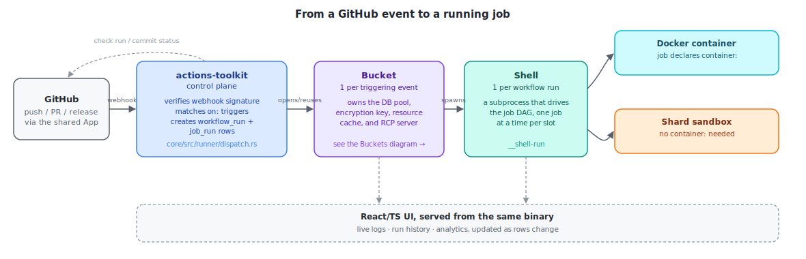
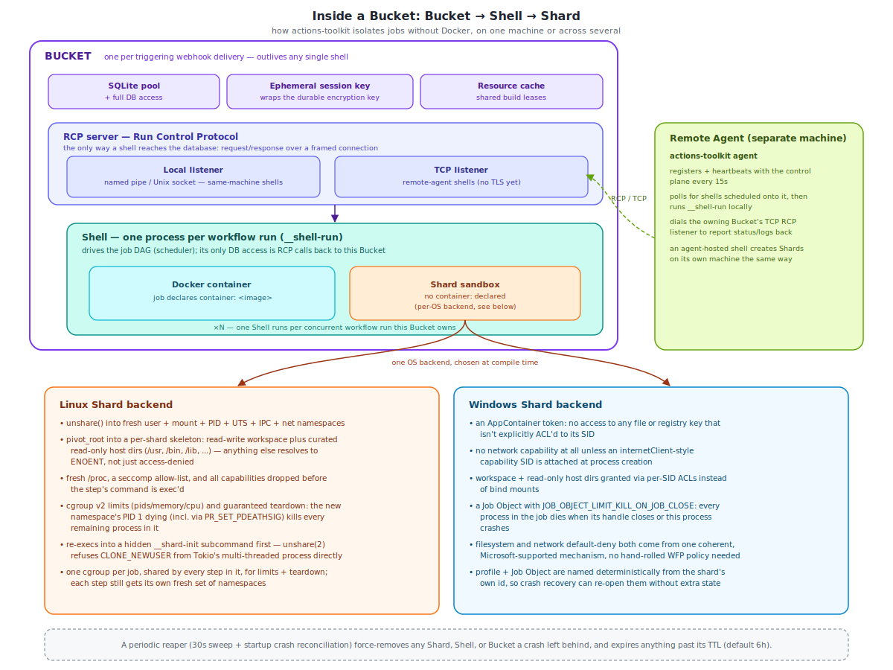

# Actions Toolkit - ATK

A self-hosted, local alternative to GitHub Actions. ATK runs your CI/CD workflows **on your own
machine** instead of GitHub-hosted runners, so you stop paying for Actions minutes while keeping a
workflow-file-driven, trigger-based pipeline you already know.

- **Rust backend** (axum + SQLite) serves a REST/WebSocket API and executes workflow jobs on the
  host, mirroring GitHub Actions' execution model: as Docker containers for jobs that declare a
  `container:` image, or through a built-in native sandbox (a "Shard") for jobs that don't.
- **React/TypeScript UI** (served by the same binary) gives you configuration, live logs, run
  history, and analytics, plus GitHub issue/PR/release management.
- **Two ways to author workflows**: a full YAML code editor (Monaco), or a drag-and-drop visual
  builder (React Flow) for triggers, jobs, steps, and conditions. Both edit the same underlying
  workflow definition; saving from visual mode regenerates the YAML, so hand-written comments and
  formatting don't survive a visual-mode save.

## Install

The backend embeds the built UI into a single binary, so installing gets you both:

```bash
curl -fsSL https://raw.githubusercontent.com/KrisPowers/actions-toolkit/main/install.sh | sh
```

On Windows (PowerShell):

```powershell
irm https://raw.githubusercontent.com/KrisPowers/actions-toolkit/main/install.ps1 | iex
```

Or via Homebrew (macOS and Linux):

```bash
brew install https://raw.githubusercontent.com/KrisPowers/actions-toolkit/main/Formula/actions-toolkit.rb
```

Either way, the installer also runs `actions-toolkit init` once, which creates the data directory
(an OS-standard per-user location, e.g. `~/.local/share/actions-toolkit`) and initializes its
SQLite database with default settings, before you ever run `start`. Then you get a single
`actions-toolkit` command:

```bash
actions-toolkit start   # or: actions-toolkit listen
```

This starts the backend API and serves the UI from the same process. By default it listens on
`:7890`; if that port is already taken, it automatically tries the next few ports up and logs
whichever one it actually bound to, so a busy default port won't stop it from starting. Pass
`--port <n>` (or `--bind-addr <addr>`) to change it; the value is saved to the database, so a
later plain `start` remembers it.

No prebuilt binary for your OS/architecture yet? Build from source, see [Development](#development)
below.

## Prerequisites

- [Rust](https://rustup.rs/) (stable toolchain) and [Node.js](https://nodejs.org/) 20+/npm, only
  if building from source
- [Docker](https://www.docker.com/) running locally, only if a workflow's job declares a
  `container:` image. Jobs without one run through the built-in Shard sandbox (native Linux
  namespaces/cgroups/seccomp or a Windows AppContainer) instead, with no Docker involved at all.
- A GitHub account that can install the shared actions-toolkit App (see below) on whichever repos
  you want to connect. No token to generate ahead of time.

## How it works

1. On first run, a setup wizard walks you through creating an admin account, then a "Connect
   GitHub" button that sends you to GitHub to authorize the shared actions-toolkit App. No token
   to generate or paste, and nothing is ever written to an env file.
2. Pick which repos to connect from the App installation's accessible-repos list (or extend the
   installation from GitHub's own settings if a repo you want isn't listed yet).
3. Connecting a repo automatically creates its webhook on GitHub, there's no manual payload
   URL/secret step.
4. Define workflows (`on:` triggers, `jobs:`, `steps:`) either as YAML or visually.
5. When a matching event arrives (or you click "Run now"), actions-toolkit checks out your repo,
   starts each job (a Docker container if it declares one, a Shard sandbox otherwise), runs each
   step, streams logs live to the UI, and captures any declared artifacts, all on your own
   hardware.

<p align="center">
  
</p>

One GitHub connection covers every repo the App installation grants access to; there's no
per-repo credential to manage, and the underlying token is never entered, displayed, or stored as
an environment variable.

If you're upgrading an existing install that was still using the old personal-access-token flow,
Settings will show a persistent "Reconnect" banner after upgrading. Your existing token keeps
working exactly as before until you click it; reconnecting swaps it for an App connection with no
other downtime.

## GitHub App

actions-toolkit authenticates to GitHub through a single shared GitHub App,
[`actionstoolkit`](https://github.com/settings/apps/actionstoolkit), owned by the project
maintainer. Its client ID is public and compiled into the binary (see `.env.example` and
`crates/atk-config/src/lib.rs`), so nothing needs registering per install; every instance authorizes through the
same App via the "Connect GitHub" button in Settings, and each user gets their own token scoped to
exactly what they personally approve, an install of the App on the repos they choose. Override
`GITHUB_APP_CLIENT_ID` (and register your own App) only if you're running a fork you want
authenticating independently of the shared one.

There's one connection per instance, not per repo: every connected repo authenticates through
whichever single App connection this instance holds, so disconnecting it in Settings pauses
workflow dispatch, webhook processing, and issue/PR/release actions for every connected repo until
it's reconnected.

## Development

```bash
# Backend (terminal 1), serves the API on :7890 (or the next free port), run from the repo root
cargo run -- start

# UI (terminal 2), Vite dev server on :5173, proxies /api and /webhooks to :7890
cd ui
npm install
npm run dev
```

Open `http://localhost:5173`. On first run the setup wizard walks you through creating an admin
account and connecting your GitHub token.

### Production build

The backend embeds the UI's built assets into a single binary via `rust-embed`, so the UI must
be built first:

```bash
cd ui
npm install
npm run build

cd ..
cargo build --release
./target/release/actions-toolkit init    # creates the data dir + database, safe to skip (start does it too)
./target/release/actions-toolkit start
```

Then open `http://<host>:7890`. Port and bind address are set with `start --port`/`--bind-addr`
(persisted to the database for next time); bind address, Docker host override, and max concurrent
jobs can also be changed from the Settings page in the UI. `.env.example` covers the remaining
advanced overrides: a custom data directory, and recovery of the JWT/encryption secrets.

## Architecture

```
core/                  Binary crate: axum HTTP/WebSocket API, app state, auth handlers,
                        Docker/Shard job orchestration, GitHub client glue. Depends on
                        every crate below.
crates/atk-crypto/      Encryption-at-rest primitives (PATs, webhook secrets)
crates/atk-auth/        JWT signing, password hashing
crates/atk-config/      CLI args and resolved on-disk config, no other internal deps
crates/atk-db/          SQLite pool, models, and the query layer (sqlx), plus migrations/
crates/atk-workflow/    Workflow YAML parsing, expression eval, trigger matching, validation
crates/atk-github/      GitHub REST API surface: checkout, releases, issues, webhooks, OAuth
crates/atk-bucket/      The Shard sandbox backend (Linux namespaces/cgroups/seccomp, Windows
                        AppContainer), plus the reaper that cleans it up
crates/atk-rcp/         Run Control Protocol framing/transport a Shell uses to talk to its Bucket
ui/                     React + TypeScript UI (Vite, Tailwind): dashboard, repo/workflow
                        management, dual-mode workflow editor (Monaco + React Flow), live
                        logs, analytics
mcp/                    MCP server exposing actions-toolkit to AI agents (see mcp/README.md)
docs/                   Additional guides beyond this README
install.sh, install.ps1,   cURL/PowerShell installers, Homebrew formula, and the script that
Formula/, scripts/         refreshes the formula's checksums after a release
```

`core` depends on every crate under `crates/`, never the other way around; each `crates/atk-*`
crate is a focused, independently-testable slice with no dependency on app state. See
[docs/ARCHITECTURE.md](docs/ARCHITECTURE.md) for the full dependency graph and why the split
lands where it does.

Workflow YAML is a scoped-down, GitHub-Actions-flavored syntax: `on:` triggers (`push`,
`pull_request`, `release`, `workflow_dispatch`), `jobs:` with a `container:` image and `needs:`
dependencies, and `steps:` with `run:` (shell) or `uses: docker://image` (container action). Job
containers stay alive for the duration of the job so multiple steps can `exec` into them
sequentially, just like GitHub's own runners. `if:` conditions support `==`, `!=`, `&&`, `||`,
`contains()`, `always()`/`success()`/`failure()`, and `needs.<job>.result`/`github.event_name`
lookups, a deliberately scoped-down subset of the full GitHub Actions expression language.

### Buckets: how a job runs without Docker

A job that doesn't declare a `container:` image still needs isolation, its own filesystem view,
its own process tree, and a hard resource ceiling, without paying for a container runtime.
actions-toolkit builds that natively out of three layered pieces:

- **Bucket** — one per triggering webhook delivery (every workflow it matches shares it). Holds
  the SQLite pool, the ephemeral encryption key, the resource-cache leases, and an RCP ("Run
  Control Protocol") server. Nothing downstream ever opens the database directly; they all
  round-trip through this.
- **Shell** — one subprocess per workflow run, spawned by a Bucket (or scheduled onto a remote
  Agent for a `runs_on` this machine can't satisfy). Drives the job DAG and talks to its Bucket
  only over RCP, whether that's a local named pipe on the same machine or TCP to a Bucket on
  another one.
- **Shard** — one ephemeral OS sandbox per `run:` step, created and torn down by the Shell that
  owns it. Linux namespaces/cgroups/seccomp on Linux, an AppContainer + Job Object on Windows,
  same effect either way: the step can't see or touch anything outside its workspace and a
  curated, read-only slice of the host toolchain.

<p align="center">
  
</p>

A few things worth calling out from that diagram:

- **A Shell never touches SQLite.** Every status update, log line, secret lookup, and artifact
  record is an RCP request/response round-trip back to its Bucket, which is what lets a Shell run
  on a completely different machine (a remote Agent) without that machine ever holding a database
  connection or the encryption key.
- **Docker and Shard are interchangeable per job**, decided purely by whether that job's YAML
  declares a `container:` image. A run can mix both across its jobs.
- **A Shard's isolation is real, not just naming.** On Linux, the step's process tree lives inside
  fresh user/mount/PID/UTS/IPC/net namespaces, `pivot_root`ed into a skeleton where anything not
  explicitly bind-mounted resolves to `ENOENT`, running under a seccomp allow-list with every
  capability dropped. On Windows, the equivalent is an AppContainer token (default-deny on
  filesystem, registry, and network unless a SID is explicitly granted) plus a Job Object
  (`KILL_ON_JOB_CLOSE` guarantees teardown even if the parent process crashes).
- **Cleanup doesn't depend on anything exiting cleanly.** A periodic reaper sweeps every 30
  seconds and reconciles again on startup, force-removing any Bucket, Shell, or Shard a crash left
  running, and expiring anything past its TTL (six hours by default).
- **Multi-machine is the same code path, not a special case.** A Shell scheduled onto a remote
  Agent runs the exact same `__shell-run` entry point a local Shell does; the only difference is
  which RCP listener it dials.

## License

[MIT](LICENSE)
